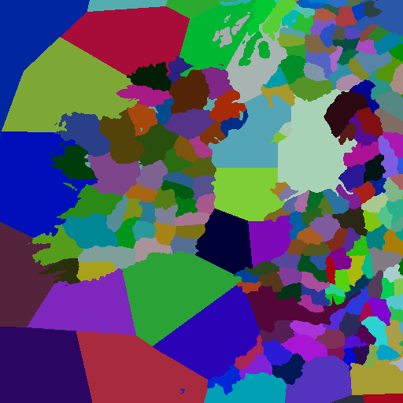
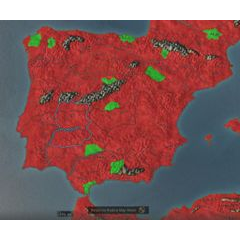

# Map modding

> **Note:** Last verified for version 1.1


In Crusader Kings III, it is possible to mod the game map. This includes editing land, seas, rivers and provinces. For modding titles, see [title modding](Title_modding.md).


- [Getting Started](#getting-started)
- [Heightmap](#heightmap)
  - [Creating a heightmap](#creating-a-heightmap)
  - [The main heightmap file](#the-main-heightmap-file)
  - [Other heightmap files](#other-heightmap-files)
    - [Repacking](#repacking)
- [River map](#river-map)
  - [Understanding river map colors](#understanding-river-map-colors)
  - [Pixel perfect](#pixel-perfect)
  - [Draw procedure](#draw-procedure)
    - [River source](#river-source)
  - [Underwater river tricks](#underwater-river-tricks)
- [Province map](#province-map)
- [Creating titles](#creating-titles)
  - [Defining baronies](#defining-baronies)
  - [Defining the holdings, religions, and culture of baronies](#defining-the-holdings-religions-and-culture-of-baronies)
  - [Landed titles](#landed-titles)
- [Terrains of provinces](#terrains-of-provinces)
- [Map locators](#map-locators)
  - [Auto nudge](#auto-nudge)
- [Connections](#connections)
- [Creating a Map with a Custom Resolution](#creating-a-map-with-a-custom-resolution)
  - [How to import the heightmap](#how-to-import-the-heightmap)
  - [Repacking terrain masks](#repacking-terrain-masks)
  - [North part of the hightmap not rendering and shows all black since 1.9](#north-part-of-the-hightmap-not-rendering-and-shows-all-black-since-19)
- [Creating Custom Terrain Textures](#creating-custom-terrain-textures)
- [Frequently asked questions](#frequently-asked-questions)
  - [Why can't I scroll all the way to the right?](#why-cant-i-scroll-all-the-way-to-the-right)
  - [Why can't I use the auto-nudge (dice) button to place my buildings and locators?](#why-cant-i-use-the-auto-nudge-dice-button-to-place-my-buildings-and-locators)
  - [Why is there a line across the screen?](#why-is-there-a-line-across-the-screen)


## Getting Started

To open the map editor:

- Navigate to the Steam Library, right-click on CK3 and open properties.
- Under the General tab, and within the "LAUNCH OPTIONS" section type -mapeditor in the specified field.
- Simply open CK3. Do this with a map that functions before you try to use anything you've created. You can import new assets later from within the editor.


## Heightmap

<figure>


<figcaption>An example heightmap of Ireland and part of Britain</figcaption>
</figure>

The heightmap is the base of every map, and defines the overall shape of the non-paper map. Heightmaps are represented as greyscale images, where black is the lowest possible elevation, and white is the highest possible elevation.


### Creating a heightmap

For real world locations, NASA provides detailed heightmaps to the public through the topography section of the Blue Marble project.

Fictional heightmaps are usually created using a combination of software, often an image editor like Photoshop or GIMP and terrain generation software like World Machine or Gaea.


### The main heightmap file

The heightmap is found at "[mod]/map_data/heightmap.png", and must be saved as a 16bit greyscale image.

The heightmap dimensions must match the "original_heightmap_size" definition defined in "[mod]/map_data/heightmap.heightmap".


### Other heightmap files

Along with "heightmap.png", there are also two important **automatically generated** heightmap files, "indirection_heightmap.png" and "packed_heightmap.png". These will be created by the CK3 map editor when a heightmap is repacked and saved.


#### Repacking

Any time the main heightmap.png is changed, you must "repack" in the map editor to make things like rivers, borders, and titles conform to the new heightmap. If you have any issues where things don't seem to be "obeying" the heightmap, the first troubleshooting step should always been to repack.


## River map

<figure>


<figcaption>An example river map of Ireland and part of Britain</figcaption>
</figure>

The river map is a special file that defines coasts and rivers, which is both used by the terrain engine to paint rivers on your map as well as to define where river crossing are for armies. It is not used for navigable rivers or other bodies of water.

**Improperly created river maps will cause a CTD.** They must be indexed RGB images with a very specific color pallet; the best way to prevent crashes when creating a river map is to start using the game's original river map, found at "[CK3 directory]/game/map_data/rivers.png". Any other colors besides those in the original color index, including antialiases or transparency, will result in a CTD.

If the river map refuses to export properly when using Gimp, **close Gimp**, copy the base game's river map into your mod folder, and then open it using Gimp. If prompted, ensure that the *colour profile* is retained (select **keep**) and ensure that the "Rendering Intent" is set to "Absolute colorimetric". This will reset any saved export settings that may be causing problems. Once you are done, choose "overwrite rivers.png" as your export option. 


### Understanding river map colors


River maps should be color indexed, which means they're saved with special encoding that indicates only certain specific colors can be used.

Each color has a specific meaning, which is translated by the game engine into nice looking rivers.
- #00ff00 (pure green) indicates the source of a river system
- #ff0000 (pure red) indicates a tributary joining the main river
- #fffc00 (pure yellow) indicates a river splitting
- #ff0080 (magenta) indicates sea, lakes, and navigable rivers.
- #ffffff (white) indicates land.

The rest of the colors are a gradient of light blue to dark blue, where the darker the blue, the wider the river.


### Pixel perfect

 Each river pixel must be orthogonally adjacent to no more than 2 other river pixels, and splits and joins must be adjacent to no more than 3 other river pixels. Two-pixel wide rivers and rivers connected using only diagonal pixels will fail to render.


### Draw procedure


You can think of the CK3 river-drawing algorithm as basically taking one of the three special pixel colors (red, yellow, or green) and using those as the starting points to draw river sections, with the green one being the starting point for the whole river system. Each river section should have one of the three pixel types at one end and none at the other. That means a river cannot leave and rejoin its parent, as often happens in real life. Red and yellow pixels on the side of river sections are separate from this limit, as they generate new river sections. Each of the three river types also dictates flow direction for the river section it generates: Green and yellow pixels cause the river to flow away from them, red pixels cause the river to flow towards them.


#### River source

There should only be a single source pixel for each river *system*; this means if a river has any tributaries, those tributaries should not have a green source pixel.


### Underwater river tricks

The pink and white colors on the river map are only for your reference; they both share the code meaning of not being rivers. Therefore, you can draw rivers through water as easily as land, they simply won't be visible. When a river ends in a lake or sea, it is recommended to continue the river a few pixels into the pink zone (or even entirely through small lakes, if it exits again on the other side) so that CK3 has a better understanding of directionality at the end of the river.

This is also helpful it you have complicated river systems which also go through lakes, as it provides you an additional tool reconcile differences between the properties of the river in real life and the capabilities of the CK3 engine.


## Province map

<figure>


<figcaption>An example province map of Ireland and part of Britain</figcaption>
</figure>

The province map defines baronies and sea regions. Each barony/sea region is defined by being of a unique color in the province map. Like the river map, a province map must avoid antialiasing and transparency.

The province map does not define counties, duchies, kingdoms, or empires. To Define Counties, Duchies, Kingdoms and Empires you need to define them in landed_titles folder

Make sure to save the provinces.png as an 8 or 24bit RGB file. If you do not save it as an 8 or 24bit RGB file then you will receive a CTD. The original province map is saved as 24bit RGB file. 8bit files can only support 256 different colours, so using this datatype would reduce you on 255 provinces/baronies (the colour black (0 0 0) is reserved for unpassable places like the alpes), If you save a Picture with more colours as 8bit supports almost all picture programmes will start a colour reduce algorythm, which will combine colours that are more or less equal to each other, which will cause many problems for CK-III as the game cannot handle other colours that the ones used in the "definition.csv".


## Creating titles

Creating titles is done by linking the colors in the province map to definitions of baronies, counties, duchies, kingdoms, and empires. The process includes the following steps:
1. Create a province map to define individual baronies
1. Identify baronies by the RGB found in the province map in "[mod]/map_data/definition.csv"
1. Define your title heirarchy in a new file in "[mod]/common/landed_titles/"
1. Create localisations for your titles in a new file in "[mod]/localization/[language]/"


### Defining baronies

To turn the colors of the province map into usable baronies, you must define them in the "definition.csv" file.

The format of barony definitions is:
```
   [ID];[RED];[GREEN];[BLUE];[Barony Name];x;
   # For example:
   2333;128;183;194;PARIS;x;
```

**IDs must be sequential, or your game will crash.**
```
   # This will work:
   1;42;3;128;CAMELOT;x;
   2;84;6;1;AVALON;x;
   3;126;9;129;TINTAGEL;x;

   # This will cause a crash:
   1;42;3;128;CAMELOT;x;
   4;84;6;1;AVALON;x;
   19;126;9;129;TINTAGEL;x;
```


### Defining the holdings, religions, and culture of baronies

Holdings, religions and cultures of baronies are defined in as part of the history data at the kingdom level. "[mod]/history/provinces/k_yourNameHere.txt"

Baronies can be as follows:

none
tribal_holding
castle_holding
city_holding
church_holding

PLEASE NOTE:
The first barony in a county (as numerically defined in definition.csv) must be occupied with a holding. The game will fill all county baronies as follows without any explicit instructions: First barony receives a castle. Faith, culture and development are transferred to the entire county. A city and then a church are then placed. The standard culture or belief is always the first entry found by the game.
This first barony will also determine the default government type of a particular county by attributing it to the main holding. At this stage only clan, tribal, holy order and feudal lords are playable in base game CK3, so make sure this is a "castle_holding", a "tribal_holding" or a "church_holding" if the faits allow it for none theocraty governments. However, it is also possible to force a different government later based on history. In the standard game, this is the case with Venice, for example. The County of Venice only consists of one castle and would therefore always create a feudal government in the standard case. To change this you have to use the title history. You do this with a text file in the title folder (&lt;Mod_root&gt;\history\titles\&lt;filename&gt;.txt). This is also the file where you set the bearer - i.e. the character - and the liege of the title. There you can then force a government with “government = &lt;NAME&gt;_government”. However, you have to be careful if you want to specify multiple start times. By default, the government for the title and therefore also for the bearer is determined by the default value, which is determined from faith and holding type (castle + Christian = feudal...). If there is such an explicit assignment in the history (this can also include the conversion from tribal -> castle), this can also increase the title hierarchy and create strange error effects. For example, if the Doge were to be made Emperor of the HRE, the Government entry in the HRE could be converted into a Republic, even though the entry was only supposed to extend to Venice in the past.

The capital of a county is always the first barony mentioned in the title definition. The capital cannot be moved. This should be taken into account when planning two points in time for a county, whereby Barony A should be the capital at the first point in time because Barony B does not yet exist, but then, due to historical development, Barony B overtakes A in importance and becomes the 'more sensible' capital of the county were.


### Landed titles

Landed titles and the de jure hierarchy have to be defined in "[mod]/common/landed_titles/". The basic structure is below.

The names (e_empire_tier, k_kingdom_tier, etc.) are just examples. "color" can be any RGB value you like. Valid capitals are county titles. Any tier can contain multiple of the next lower tier (e.g. 5 kingdoms in 1 empire).

Baronies appear in the game in the same order as in the file. I.e. the first one will be the default capital. The engine will use the capital barony's culture and religion set in "[mod]\history\provinces@_title.txt" to determine its county's culture and religion at any set date.

```
   e_empire_tier = {
       color = { 0 0 0 }
       capital = c_county_tier

       k_kingdom_tier = {
           color = { 0 0 0 }
           capital = c_county_tier

           d_duchy_tier = {
               color = { 0 0 0 }
               capital = c_county_tier

               c_county_tier = {
                   color = { 0 0 0 }

                   b_barony_tier = {
                       color = { 0 0 0 }
                       province = id (defined in map_data/definition.csv)
                   }
               }
           }
       }
   }
```


## Terrains of provinces

You can set each province's terrain in [mod]/common/province_terrain/00_province_terrain.txt. 

Each line's format is [prov_id]=[terrain] (plains/farmlands/hills/mountains/desert/desert_mountains/oasis/jungle/forest/taiga/wetlands/steppe/floodplains/drylands).

Note that the modification will take effect immediately in the game.


## Map locators

Once baronies have been defined, the locations (positions) of their four main locator objects can be defined. This will tell the engine where to place each sea tile's raised army (ship placement), as well as the holding building, raised army, army combat and siege weapon objects for each barony on the map. The positions of these four locators are defined in the building_locators.txt, combat_locators.txt, player_stack_locators.txt and siege_locators.txt files respectively, which can be found in "[mod]/gfx/map/map_object_data/".

Within these files, each barony is represented by an instance where the position, rotation and scale of the map objects can be set.  For example, the following code defines the locator for a single barony with ID = 1 at standard size and co-ordinates of x = 2,000 and y = 1,000 on the map: 

```
   instances={
       {
           id=0
           position={ 2000.000000 0.000000 1000.000000 }
           rotation={ 0.000000 0.000000 0.000000 1.000000 }
           scale={ 1.000000 1.000000 1.000000 }
       }
   }
```

These values, specially raised army's position for both sea and land provinces, are used to define troop movement pathfinding. At any time, the position, rotation and scale of these objects can be finessed using the Map Objects Editor in the in-game map editor.

Be mindful that if there is any serious problem with a mod's locator files, errors.log should indicate that four files (generally holding buildings, raised army, army combat and siege weapon locator text files) have been created in the "[user]\[documents]\Paradox Interactive\Crusader Kings III\generated" folder. You can then copy those over to your mod's "[mod]/gfx/map/map_object_data/" folder, replace the old files and re-start the in-game map editor.


### Auto nudge

The in-game map editor contains an auto nudge tool (represented by a dice button on the object placement mode) that allows users to automatically generate land province's object locator files and randomly test new object positions within a given province. To use it, an editor should use the province selection tool, select which province's it wants to randomize, and then click the nudge tool button. The map-editor should then try to spawn each of the default objects on all selected provinces. 

In case there are any invalid positions (such as objects spawned outside the province's area due to lack of valid spawning space), affected provinces will be crossed by red stripes on the map. To fix the issue, the user should then either select any red-stricked provinces and try a new random valid position by clicking the auto nudge button again or drag any invalid objects into the province manually.

The in-game map editor also allows users to fine-tune the auto nudge tool's spawning settings. To facilitate random placement with the auto nudge tool, an user may reduce the collision box of objects or tweak the minimal and max distances between each object. Users should be aware that the default siege engine's settings are optimized so that the siege engine's animation properly interacts with the holding building object.


## Connections

Baronies can be connected in two ways: having adjacent pixels, or having a connection defined in "[mod]/map_data/adjacencies.csv".

Entries in "adjacencies.csv" take the format:
```
   ID From;ID To;Type;ID Through;start_x;start_y;stop_x;stop_y;Comment
   #For example:
   1527;1526;river_large;629;948;2791;-1;-1;London-Southwark
   -1;-1;;-1;-1;-1;-1;-1;
```

- ID From, ID To, and ID Through are all IDs found in "definition.csv"

- ID From and ID To are baronies; ID Through is a sea or navigable river.
- Type is either "sea" or "river_large"
- start_x start_y are the (x, y) coordinates from which an army 'embarks' in the "ID From" barony.
- stop_x and stop_y are the (x, y) coordinates to which an army 'lands' in the "ID To" barony.
- start_x, start_y, stop_x, and stop_y can all use "-1" instead of actual coordinates, which will default to wherever the normal army placement is in that barony.
- Preserve the "-1;-1;;-1;-1;-1;-1;-1;" at the end of the file, **even if the rest of the file is blank**. Doing otherwise will result in an infinite loading screen.


## Creating a Map with a Custom Resolution

**Note:**
- Width and height are the new widths and height you are setting for your mod.
- When you open .dds files such as the surround_mask.dds, check if it has mipmaps. If that is the case, generate new mipmaps for the resized file.
- There is, as of version 1.9.2.1, a bug that cuts off the northern part of the heightmap and leaves it looking all black. It seems to happen depending on the aspect ratio between width and height. Experiment with different widths until it goes away.

- common/defines/00_defines.txt:
```
   WORLD_EXTENTS_X # Should be: map width - 1 
   WORLD_EXTENTS_Z # Shoud be: map height - 1 
   WATERLEVEL # Corresponds to the heights from the heightmap - if too low, no oceans/lakes will appear. If too high, the entire map will be covered with water
```

- common/defines/graphic/00_graphics.txt
```
   PANNING_WIDTH # However far you want the player to be able to pan left to right. Panning to the edge would mean this is equal to map width
   PANNING_HEIGHT # However far you want the player to be able to pan up and down. Panning to the edge would mean this is equal to map height
```

- gfx/map/surround_map/
   - surround_mask.dds     # Size should be: (width x height) * 1/2 # Note, game will load even if the dimensions on this are wrong
   - surround_fade.dds     # Size should be: (width x height) * 1/8 # Note, game will load even if the dimensions on this are wrong

- gfx/map/terrain/     # All files in this that have _mask (63 as of 1.3) or .tga (2 as of 1.3) in the name need to be resized TO: (width x height)
   - flatmap.dds     # Size should be: (width x height) # Note, game will load even if the dimensions on this are wrong
   - colormap.dds     # Size should be: (width x height) * 1/4 # Note, game will load even if the dimensions on this are wrong
   - detail_intensity.tga     # Size should be: (width x height) # Note, game will load even if the dimensions on this are wrong
   - detail_index.tga     # Size should be: (width x height) # Can be altered, but size must match plains_01_mask.png
   - ..._mask.png     # Size should be: (width x height)     # These files should be saved as 16 or 8 bit greyscale images, game will load even if the color-mode is rgb or rgba, it will convert the image to greyscale. Game will load even if the dimensions on this are wrong. The height of plains_01_mask.png must &lt;= 4096, and the size of it must match detail_index.tga

- gfx/map/water/
   - flowmap.dds     # Size should be: (width x height) * 1/4 # Note, game will load even if the dimensions on this are wrong
   - foam_map.dds     # Size should be: (width x height) * 1/8 # Note, game will load even if the dimensions on this are wrong
   - watercolor_rgb_waterspec_a.dds     # Size should be: (width x height) * 1/2 # Note, game will load even if the dimensions on this are wrong

- map_data/
   - heightmap.png     # Size should be: (width x height)  Ensure that this is in RGB format and not RGBA. If you get a white fog it might be because the heightmap was exported as RGBA. To fix this, you need to delete the alpha layer
   - provinces.png     # Size should be: (width x height)  # Note, game will load even if the dimensions on this are wrong. It has to match the size of rivers.png or game will crash
   - rivers.png     # Size should be: (width x height) # Note, game will load even if the dimensions on this are wrong, It has to match the size of provinces.png or game will crash. If it does not match the actual size of the map, the game will display the map with issues
   - indirection_heightmap.png     # Size should be: (width x height) * 1/32
   - heightmap.heightmap
```
   original_heightmap_size # Should be { width height } the width and height here should be the size of heightmap.png
```

- content_source/map_objects/masks     # All files in this that have _mask (21 as of 1.0) need to be resized TO: (width x height) * 1/2  Ensure that this has 8-bit depth as other depths like 32 cause errors like misplacing trees or painting large squares of trees.

### How to import the heightmap

If you are struggling to get the custom heightmap to load or repack (this can be especially problematic with larger heightmaps) try the following procedure. This works as of 1.1.3:

1. Copy the vanilla indirection_heightmap.png and packed_heightmap.png over to the mod's map_data directory
1. Delete indirection_heightmap.png and packed_heightmap.png in the vanilla folder
1. Load the map editor and repack the map. The repacked map files should be in the vanilla map_data directory
1. Copy the new indirection_heightmap.png and packed_heightmap.png from the vanilla directory to the mod's map_data directory
1. For Steam users, verify the integrity of the game cache to redownload the vanilla indirection_heightmap.png and packed_heightmap.png files


### Repacking terrain masks

The same procedure as the height map also works for terrain masks as of 1.3.1. If your terrain is appearing black, delete all vanilla "_mask.png" files from gfx\map\terrain in the main CK3 folder, then repack.


### North part of the hightmap not rendering and shows all black since 1.9

Since 1.9 update. some resolutions of custom maps does not render the north half of the map. As tested (1.13), it appears that the widths and heights of images in mod files do **NOT** have to follow the guidelines above. You can simply change the resolution of map_data\heightmap.png so that width is somehow greater than height. You then need to change the data in map_data\heightmap.heightmap file to match the heightmap.png image. You can leave all other images and script values (like those in defines) unchanged, and the game will still display the map as the original (as mod, not as vanilla game) size without issue.


## Creating Custom Terrain Textures

You will find existing CK3 textures in game\gfx\map\terrain and it is recommended to copy a few files over to your mod to tweak and experiment.

New terrain textures can be added in [mod]\gfx\map\terrain

To add a new texture, you will need three .DDS textures, a diffuse texture, a normal texture, a properties texture and a mask that you add to the above mentioned folder.

material.settings is the file where you add new terrain layers with script, link in your new textures here (by also copying it over to your mod).

settings.terrain controls data for how all materials act globally, like how they blend, tile and such.

The mask.bmp file needs to be the same size as the heightmap.bmp

Paradox uses the Metalness-Roughness PBR workflow. The texture files have some texture channels switched around, channels refering to Red, Green, Blue, Alpha. Therefore; it is important to understand your changes must be worked on channels in .DDS files and not the whole layer. For diffuse file as an example, if you have the alpha channel not deselected, your texture may look white and bugged in-game. Again, work through channels.

For Diffuse:

Diffuse RGB - RGB

Diffuse A - Material heightmap, used for blending.

Normal:

Normal R -> Normal R

Normal G -> Normal R

Normal B -> Emissive (fill black, unless you like self illumination)

Normal A -> Normal G

Properties:

Properties R -> Unused

Properties G -> Specular intensity  - Used sparingly on metallic surfaces.

Properties B -> Metalness

Properties A -> Roughness

**Note! - After adding a new texture you will need to re-export the map for the optimized detail maps to be updated. Otherwise the games textures will offset and you'll get snow instead of grass or the like.**


## Frequently asked questions


### Why can't I scroll all the way to the right?

You have to open common/defines/graphic/00_graphics.txt and set 
	PANNING_WIDTH =  8192
or whatever the equivalent pixel width of your map is.


### Why can't I use the auto-nudge (dice) button to place my buildings and locators?

Due to a bug, you'll need to have those defined *before* you can auto nudge. Luckily the game generates them for you.

Copy all of the files in:
```
   C:\Users\[user]\Documents\Paradox Interactive\Crusader Kings III\generated
```

Paste them into:
```
   \gfx\map\map_object_data
```


### Why is there a line across the screen?

Make sure that the map dimensions in common/defines are width - 1 and height - 1 and that the terrain masks are all the correct size.


1. Creating Custom Map Modes

<figure>


<figcaption>Custom Map Mode that renders where special buildings can be built.</figcaption>
</figure>
Crusader Kings 3 features the ability to visually filter the map in different ways at the click of a button. This is not intended to be a moddable feature but there are ways to create simple custom map modes nevertheless.

Before making a custom map mode you should first evaluate if it will be worth doing. Currently, custom map modes are arduous to script, difficult to maintain and likely to cause compatibility issues with future versions.

The first step in the creation of a custom map mode is to create custom titles that hold our colors, we could just take them from pre-existing titles, but it will be much easier to manage if we make our own.
Create a file named ``custom_map_colors_titles.txt`` at ``mod\custom_map_modes_mod\common\landed_titles`` and script the following:


```CoffeeScript
1. Here are the titles the baronies get their color from. Uses RGB 255.
d_map_base_color = {
	color = { 84 78 60 }
	can_create = { always = no }
}
d_map_color_red = {
	color = { 255 0 0 }
	can_create = { always = no }
}
d_map_color_green = {
	color = { 0 255 0 }
	can_create = { always = no }
}
d_map_color_blue = {
	color = { 0 0 255 }
	can_create = { always = no }
}
d_map_color_cyan = {
	color = { 0 255 255 }
	can_create = { always = no }
}
d_map_color_yellow = {
	color = { 255 255 0 }
	can_create = { always = no }
}
d_map_color_orange = {
	color = { 255 128 0 }
	can_create = { always = no }
}
d_map_color_pink = {
	color = { 255 0 255 }
	can_create = { always = no }
}
```


Next, we have to create a file that will hold the logic for rendering the custom map mode. We will name it ``custom_map_modes.txt`` and place it at ``..mod\custom_map_modes_mod\gfx\map\map_modes``.

Then we'll make our script:


```CoffeeScript
custom_mapmode = {
	color_mode = baronies
	small_map_names = baronies
	large_map_names = baronies
	selection = holding
	fill_in_impassable = no

	barony_description = { # Optional
		desc = {
			triggered_desc = { # You can set up multiple ones
				trigger = {
					has_special_building = yes
				}
				desc = east_europe.0111.t.setup # Placeholder
			}
		}
	}

	gradient_parameters = {
		zoom_step =					2
		gradient_alpha_inside = 	1
		gradient_alpha_outside = 	1
		gradient_width = 			0.4
		gradient_color_mult =		1
		edge_width = 				0
		edge_sharpness = 			0
		edge_alpha = 				0
		edge_color_mult = 			0
		before_lighting_blend =		1
		after_lighting_blend =		0.5
	}
}
```


Next, we will create the file that holds our custom map mode's logic. This is where things get complicated.

For this example, we're going to use very simple logic which highlights where a special building slot exists.

We'll first create a file named ``custom_mapmodes_gui.txt`` at ``mod\custom_map_modes_mod\common\scripted_guis`` and we'll script our logic as such:


```coffeescript
highlight_special_buildings_map = {
	effect = {
		if = {
			limit = { NOT = { global_var:custom_map_mode = flag:highlight_special_buildings_map } }
			set_global_variable = {
				name = custom_map_mode_changing
				value = 1
			}
			set_global_variable = {
				name = custom_map_mode
				value = flag:highlight_special_buildings_map
			}
			every_barony = {
				if = {
					limit = { 
						title_province = { has_special_building_slot = yes }
					}
					set_color_from_title = title:d_map_color_green # Green where a slot exists
				}
				else = {
					set_color_from_title = title:d_map_color_red # Red where it does not
				}
			}
			remove_global_variable = custom_map_mode_changing
		}
	}
	is_shown = {
		exists = global_var:custom_map_mode
		global_var:custom_map_mode = flag:highlight_special_buildings_map
	}
	is_valid = {
		NOT = { exists = global_var:custom_map_mode_changing }
	}
}
```


You'll notice how our script has two variables named ``custom_map_mode`` and ``custom_map_mode_changing``, these variables are used to keep track of which custom map logic is currently overwriting our ``custom_mapmode`` script. When making additional map modes you should rename ``custom_map_mode``'s flag to that map mode's name.


<details>
<summary>Additional example: `religion_organization_map`</summary>

<code style="white-space: pre">religion_organization_map = {<br>    effect = {<br>        if = {<br>            limit = { NOT = { global_var:custom_map_mode = flag:religion_organization_map } }<br>            set_global_variable = {<br>                name = custom_map_mode_changing<br>                value = 1<br>            }<br>            set_global_variable = {<br>                name = custom_map_mode<br>                value = flag:religion_organization_map<br>            }<br>            every_barony = {<br>                if = {<br>                    limit = { <br>                        title_capital_county = { <br>                            faith = {<br>                                has_doctrine = unreformed_faith_doctrine<br>                            } <br>                        }<br>                    }<br>                    set_color_from_title = title:d_map_color_red                <br>                }<br>                else = {<br>                    set_color_from_title = title:d_map_color_blue<br>                }<br>            }<br>            remove_global_variable = custom_map_mode_changing<br>        }<br>    }<br>    is_shown = {<br>        exists = global_var:custom_map_mode<br>        global_var:custom_map_mode = flag:religion_organization_map<br>    }<br>    is_valid = {<br>        NOT = { exists = global_var:custom_map_mode_changing }<br>    }<br>}</code>

</details>


Now that all the logic is done, it is time to add it to our UI.

We're going to need to copy the file ``mapmodes.gui`` from ``..game\gui\shared`` to our mod folder in ``..mod\custom_map_modes_mod\gui\shared``.

After doing that, open the file and find the **first** instance of the following script block:


```CoffeeScript
text_single = {
	parentanchor = hcenter
	text = "ADDITIONAL_MAPMODES"
	default_format = "#medium;italic"
	margin_bottom = 5
	max_width = 110
}
```


Once located, add the necessary script to create an additional button below it.

```CoffeeScript
button_tertiary = {
	name = "special_slot_map"
	visible = "[CanChangeMapMode]"
	parentanchor = hcenter

	size = { 110 25 }
	onclick = "[SetMapMode('custom_mapmode')]"
	onclick = "[GetScriptedGui('highlight_special_buildings_map').Execute(GuiScope.End)]"
	down = "[And( GetScriptedGui('highlight_special_buildings_map').IsShown(GuiScope.End), IsMapMode('custom_mapmode') )]"
	enabled = "[GetScriptedGui('highlight_special_buildings_map').IsValid(GuiScope.End)]"

	text = "COURT_POSITION_CATEGORY_SPECIAL_NAME"

	tooltip = "single_combat.0031.desc.sc_defender.butchery"
	using = tooltip_ws
}
```


In this case, ``custom_mapmode`` is what we are using to render on a per-barony basis and ``highlight_special_buildings_map`` is the specific logic we are running through it. You don't need to make a new ``custom_mapmode`` script each time you change logic.

With all this complete, you should now have a custom map mode in the "more map modes" tab. Congratulations.


Category:Modding

---

*Source: https://ck3.paradoxwikis.com/Map_modding*
