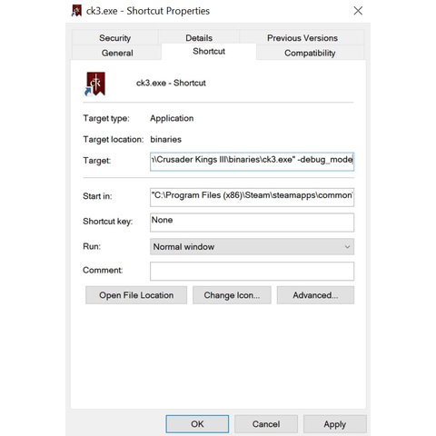
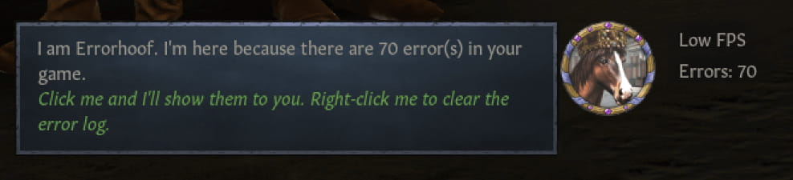
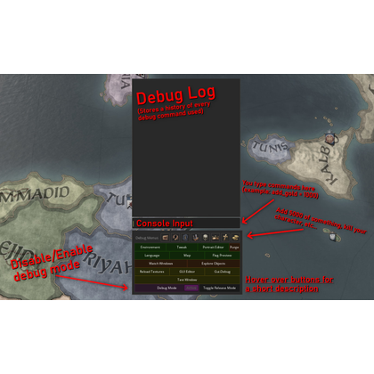
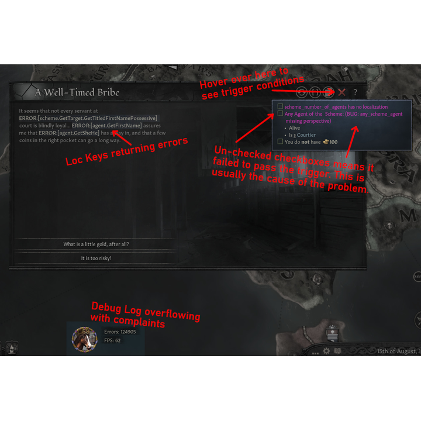

# Mod troubleshooting

## Basics of the Developer Console & Enabling Debugging

<figure>


<figcaption>A screenshot of a shortcut created from the CK3 steam build binary.<br><sup>Note: if you are using the Steam version of the game, you can right click on the title in your library, click "properties" and add <code>-debug_mode startup</code> to your launch options.</sup>|x480px</figcaption>
</figure>




Debugging is easy! <sup><span class="plainlinks">[[Citation Needed](https://en.wikipedia.org/wiki/Wikipedia:Citation_needed)]</span></sup> This page will help you understand how to debug and fix issues with your script.


### Getting Access to the Debug Tools

The first thing you want to do is enable debug on your game, to do this you must find your game's .exe file (eg: ``C:\Program Files (x86)\Steam\steamapps\common\Crusader Kings III\binaries``) and create a shortcut with the ``-debug_mode`` parameter at the end. View the image on the right for an example. Once this has been done, you will be able to access the developer console in-game via the ````` key; Known as the ["grave accent"](https://en.wikipedia.org/wiki/Grave_accent) key, which is usually located at the top left of a keyboard. This will also allow you to get messages from Errorhoof warning you of any script errors: the game will automatically open a notepad window with a list of any errors at it finds startup, but clicking error hoof will allow you to create a new notepad window with all the latest and greatest of your mistakes.


### The Basics of the Developer Console

Below is an image explaining what each button in the debug UI does:

To test your event, simply type ``event name.id`` into the command input window and press enter (examples: ``event diplomacy_foreign.1074`` and ``event central_asia.0011``).
This is the primary way of testing events that have not yet been added to a pulse or otherwise connected to the game in any way a player could naturally encounter. You can also use that same window to execute effects such as ``add_gold = 999999`` and ``add_trait = lunatic_genetic`` to help meet the conditions necessary to properly run the event you are testing.


- [Basics of the Developer Console & Enabling Debugging](#basics-of-the-developer-console-enabling-debugging)
  - [Getting Access to the Debug Tools](#getting-access-to-the-debug-tools)
  - [The Basics of the Developer Console](#the-basics-of-the-developer-console)
- [The Art of Debugging](#the-art-of-debugging)
  - [Localization Debugging](#localization-debugging)
  - [Error Spam: Debugging Dynamic Loc and Trigger Conditions](#error-spam-debugging-dynamic-loc-and-trigger-conditions)
  - [Scope Debugging](#scope-debugging)
  - [Hot-loading](#hot-loading)
- [Automating the Debug Process Through Run Scripts](#automating-the-debug-process-through-run-scripts)


## The Art of Debugging

Confused by an error? *Great!* The first step is to *remain calm* and read the error again while taking the text as literally as possible. If an error says it does not recognize a loc key, then it probably means exactly that.

Below is some general advice that will help solve your issue 80% of the time, for the remaining 20%, reach out to other members of the CK3 modding community. Modders are (mostly) friendly folk ready to lend a hand to beginners and they are sure to answer your many questions.

<sub>Note: Newer error logs are at the top, while older logs will be at the bottom. Be sure to clear your console to remove old errors.</sub>


### Localization Debugging

Localization has improved a lot since the epoch of Crusader Kings 2 and it is now easier than ever, but that does not mean it is fool-proof.

The first thing you must make sure of is that your loc file is encoded correctly (the game will tell you if it is not), you should use ``utf8bom``. Here is how you save your loc file with the correct encoding:
- **Sublime Text**: File → "Save With Encoding..." → "UTF8 with BOM"
- **Visual Studio Code**: At the bottom of the window (bottom-most right) is the encoding and syntax highlight tab, select UTF8 (or whatever else it is set to) → "Save with Encoding" → "UTF8 with BOM"
- **Notepad++**: Encoding → "UTF8 with BOM"


You may also encounter issues with missing keys, unrecognized keys or duplicate hashes:
- **Missing Key**: You probably misspelled the loc key or forgot to save (it happens to the best of us), make sure to save, double-check and re-type your loc key.
- **Unrecognized Key**: Same solution as above, but this also happens when you use a string in your script (using "my text here" instead of a loc key). To solve the issue simply make a key with the contents of your string.
- **Duplicate Key or Hash**: Somewhere either in or outside your file there is a key with the same name or content as another key. Search and destroy/replace.


### Error Spam: Debugging Dynamic Loc and Trigger Conditions

Are you getting thousands of errors every second you run your event? *Don't panic!*

The first thing you want to do is check your dynamic loc, make sure you did not make a mistake when writing it. Here are some common mistakes:
- Writing ``[ROOT.GetSomething]`` when you meant to do ``[ROOT.Char.GetSomething]``
- Misspelled a name, it happens. A lot.
- Used ``[scope:mysavedscopecharacter.GetFirstName]`` instead of ``[mysavedscopecharacter.GetFirstName]``, saved scopes do not need ``scope:`` when using them in dynamic loc.
- You did not actually save the character you referenced in the scope of the dynamic loc.
- The name of the scoped character was changed in the script and you forgot to update it in the loc.


If you did everything correctly but are still getting issues with dynamic loc, then that must be that **you did not meet the conditions for the event fired.**

When launching an event via the debug console, the event itself will trigger even if you do not meet all of the specified conditions. This means that it might have failed to save a character that could not be scoped into because the trigger failed.

To find out whether or not you meet the conditions of the event fired via the debug console, hover over the ✔ or ✖ icon at the top right of your event window. This will show you a detailed view of the conditions of your event and whether or not they were met.




### Scope Debugging

It is possible to generate a folder containing every trigger, effect, modifier and runtime log that is recognized by code by typing ``script_docs`` into the developer console. The resulting files will then be dumped at ``C:\Users\YOURUSERNAME\Documents\Paradox Interactive\Crusader Kings III\logs`` and can be read using notepad or an IDE of choice.

These ``.log`` can be opened with notepad and are very useful for debugging a variety of issues, as well as 
Here is an overview of the most useful files and their contents:

| **File** | **Description** |
| --- | --- |
| Effects.log | Contains a list of all non-scripted (hardcoded) effects, how they should be used and what their potential [arguments](https://en.wikipedia.org/wiki/Parameter_(computer_programming)) are. |
| Triggers.log | Contains a list of every non-scripted trigger found in the game and what scopes and targets they support. |
| Modifiers.log | List of every modifier that can be used in scripted modifiers and lists what types they can be used in. |
| event_scopes.log | Every valid scope type. Keep in mind that you should not directly reference a type. |
| event_targets.log | Every possible event target as recognized by the script. Very useful for crawling up or down from one scope to another via [parent-child relations](https://en.wikipedia.org/wiki/Inheritance_(object-oriented_programming)). |


### Hot-loading

Hot-loading, in the context of CK3, is the act of updating scripts *while the game is still running*.

This means you can test minor changes in your script and debug it in real-time without the need to restart the game each time.
However, one should be careful with hot-loading, as making sizable changes can lead to the game behaving unexpectedly. If you make a large set changes (or one that interacts with elements outside of the updated script), it is adviced that you re-start the game to avoid spending hours debugging an error that only exists because the changes were hot-loaded improperly.
**Tips For Hot-loading Safety:**

1. If possible, have the event closed when you hot-load a change.
1. Otherwise, you can press the [⟳] icon on the event debug options. Be warned that this will not update saved scopes.
1. Localization can be updated at any time. But new localization keys will usually not hot-load.
1. Use hot-loading to debug and tweak, not to test if the script has any start-up errors.


## Automating the Debug Process Through Run Scripts

When testing more complex features and/or content, a great deal of time can be saved by automating the repetitive actions needed to meet the conditions necessary to access the target feature/content. Run Scripts execute effects in the same way as an events `immediate` block would, meaning that it can be used to store a large chain of effects meant to skip over the aforementioned repetitive manual work.


From a technical perspective, Run Scripts are `.txt` files stored in `..\Documents\Paradox Interactive\Crusader Kings III\run` which immediately execute any effects scripted inside them when fired through the following console command: `run run_script_name_here.txt`

Here is an example of what the contents of a run script look like:

```coffeescript
1. Run Script to set up the conditions for restoring the HRE. Recommended to start as King Luis (867).
title:c_cologne = { add_to_list = target_titles }
title:c_mainz = { add_to_list = target_titles }
title:c_trier = { add_to_list = target_titles }
title:d_bohemia = { add_to_list = target_titles }
title:d_east_franconia = { add_to_list = target_titles }
title:d_ostfalen = { add_to_list = target_titles }
title:d_ostmark = { add_to_list = target_titles }
title:k_lotharingia = { add_to_list = target_titles }
title:k_italy = { add_to_list = target_titles }
title:k_east_francia = { add_to_list = target_titles }

create_title_and_vassal_change = {
	type = conquest
	save_scope_as = change
}

every_in_list = {
	list = target_titles
	limit = { NOT = { holder = root } }
	every_in_de_jure_hierarchy =  {
		change_title_holder = {
			holder = root
			change = scope:change
		}
	}
}
resolve_title_and_vassal_change = scope:change

add_hook = {
	target = faith.religious_head
	type = strong_test_hook
}

root = {
	add_prestige = 4000
	add_gold = 500
	add_piety = 200
}
```


Category:Modding

---

*Source: https://ck3.paradoxwikis.com/Mod_troubleshooting*
