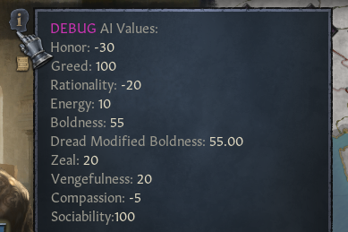

# AI modding

Portions of AI are done in game code and cannot be modded. We say they are "hardcoded".

For example, army behavior is entirely hardcoded.

We can influence AI through:

- **defines** - values used in code
- **chance and triggers** - how likely AI is to choose an event option or take a decision, based on their situation, and can they do it
- **AI personality values** - values influenced by traits and modifiers, which are then checked in script
- **script** - we can write custom events for AI, like how war is handled for conquerors


- [Defines](#defines)
- [Chance](#chance)
- [AI personality](#ai-personality)
- [Script](#script)


## Defines

``common/defines/ai`` folder contains values that are referenced by game code.

We don't know what exactly the code does, but the dev comments explain what these numbers affect. E.g.:

``BETROTHAL_MIN_AGE = 12  # The AI will not betrothe, nor seek betrothals with characters under this age.``

A few AI defines can also be found in ``common/defines/00_defines.txt``.


## Chance

Many interactions have scripted chance for AI.

For example, in events, AI is more likely to choose the option with higher ai_chance.

```c
ai_chance = {
  base = 10
  modifier = {
    add = 100
    has_trait = chaste
  }
  modifier = {
    factor = 0
    has_trait = deviant
  }
  ai_value_modifier = {
    ai_zeal = 1  
  }
}
```

``modifier`` changes the base value if its trigger is true. Can hold multiple conditions.

In this case, it would add 100 if the character has the chaste trait.

``factor`` means multiplication, here it would multiply by 0 if the character is a deviant.

``ai_value_modifier`` adds or subtracts based on the character's personality, multiplied by the number.

Here, each point of ai_zeal counts for 1.


``trigger = { is_ai = no }``  can disable events and their options entirely for AI.

Some effects can also be different for AI and players, by using ``limit = { is_ai = yes }``

In other places, there are options like ``ai_will_do, ai_potential, ai_score``

There are too many to list them all here.

Read the .info files in the game folders, they list all available options and the comments explain how they work.


## AI personality

Traits and modifiers can change AI personality values, like ai_zeal.

These values are then checked in script, in many places, to change AI behavior.
<figure>


<figcaption>AI values tooltip</figcaption>
</figure>

All parameters used by traits and modifiers:

- ai_amenity_spending
- ai_amenity_target_baseline
- ai_boldness
- ai_compassion
- ai_energy
- ai_greed
- ai_honor
- ai_rationality
- ai_sociability
- ai_vengefulness
- ai_war_chance
- ai_war_cooldown
- ai_zeal

In game, you can see them by hovering over the head icon at the top of the character window.

Launch the game with -debug_mode to show it.


## Script

We can script our own AI behavior, through story cycles, events an on_actions.

For an example, see how the game handles conquerors.

There is a story cycle that fires an effect every 1-2 months:

``common\story_cycles\story_cycle_conqueror.txt``

It then fires a scripted effect ``ai_conqueror_yearly_effect``:

``common\scripted_effects\00_ai_conqueror_effects.txt``

That effect has almost 2000 lines, managine schemes, budgeting and declaring wars.


Be careful not to ruin performance by using complex script on all living characters.

Category:Modding

---

*Source: https://ck3.paradoxwikis.com/AI_modding*
