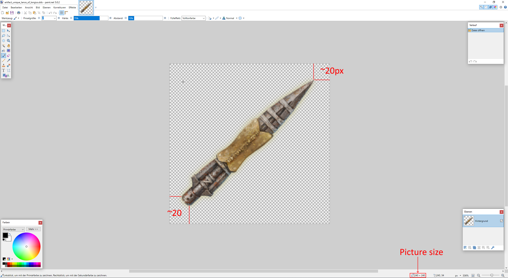

# Artifact modding

> **Note:** Last verified for version 1.8


> ⚠️ **This section needs expansion with examples, advanced uses**


[Artifacts](https://ck3.paradoxwikis.com/Artifacts) can be modded into the game.


- [Location](#location)
  - [Templates](#templates)
    - [Structure](#structure)
  - [Visuals](#visuals)
    - [Structure](#structure)
  - [Creation Effect](#creation-effect)
  - [Creating starting Artifacts](#creating-starting-artifacts)


## Location

The code for the artifacts is spread over several scripts. Most are in the common/artifacts folder. In contrast to titles, artefacts do not exist at the beginning of the game and generally have no history of their own. Artifacts are created exclusively by a creation effect - for historical artifacts, said effect is performed at the beginning of the game.


### Templates

Templates provide information about the possible uses of an artifact. Here you set for an artifact whether it can be equipped, whether there are usage requirements and a possible replacement effect if the inert does not meet the requirements.

All templates must be in a text file with any name in the folder "common/artifacts/templates" so that the game can find the data.


#### Structure


```
example_template = {

	# can this character equip this artifact?
	can_equip = {
		always = yes
	}

	# can this character benefit from the full modifiers of the artifact?
	can_benefit = {
		is_christian_trigger = yes
	}

	# can this character reforge this artifact (turn this artifact into another)
	can_reforge = {
		is_christian_trigger = yes
	}

	# can this character repair this artifact (restore its durability)
	can_repair = {
		always = no
	}

	# if a given character does not pass the "can_benefit" trigger then this modifier will be applied instead.
	fallback = {
		monthly_prestige = 0.3
	}

	# Adds the final value to the AI equipping score, note the can_benefit takes precedence over the score when AI equipping
	# artifact_ai_will_equip_score in game/common/script_values/00_artifact_values.txt also effect the final score
	ai_score = {
		value = 100
	}

	# Artifacts with this templates show as unique, default = no 
	unique = yes
}
```


For the can_benefit clause, for example, the following checks can be made for the carry char using **and**, **or**, **not** or **nor**:

- has_faith = faith:&lt;faith_key&gt;
- culture = culture:&lt;culture_key&gt;
   - has_culture = culture:&lt;culture_key>  # is also working correctly but the cultures loc cannot be loaded on this way so using this is not recommended
- culture = { any_parent_culture = { this = culture:&lt;culture_key> } }
- culture = { has_cultural_pillar = &lt;heritage_key> }
- culture = { has_cultural_tradition = &lt;tradition_key&gt;}
- has_title = title:&lt;title_key&gt;
- has_trait = &lt;trait_key&gt;
- has_religion = religion:&lt;religion_key&gt;
- dynasty = dynasty:&lt;dynasty_key&gt;


Warning: Using 'has_dynasty' doesn't appera wrong at the error log but doesn't work ingame


### Visuals

The visuals bundle the 2d and - if available - 3d references for an artifact. A visual entry is accordingly quite simple and usually consists of 2 to three entries. The first entry is a reference to the icon. The icon is a 240px² dds file located in the folder '&lt;modroot&gt;/gfx/interface/icons/artifact'.

For optical reasons, you should keep about 30 pixels of purely transparent space in each direction from the actual object. For example, if you want to insert a bag as an icon, you should first crop the said bag with an image editing program without borders or surroundings. Then the image of the cut object is set in such a way that the larger value of height and width of the image has the value 180px, and the other is scaled accordingly. Then you increase the image size from the center to 240px for height and width. This can be done relatively easily with the image editing program paint.NET, for example. If you don't keep a 30px border in each direction, the icon of the artefact in the in-game artefact shop would overflow the frame of the icon. This has no effect on the gameplay, but it looks bad.


The 3D representation of an artefact is controlled via the asset entry.

<figure>


<figcaption>The original "artifact_unique_lance_of_longius.dds" file from CK3 open in paint.net</figcaption>
</figure>


#### Structure


```
example = {
	icon = "icon_name.dds"
	asset = "asset_name"

	# optional field with no gameplay effect. Only needed for automatic test artifact generation
	default_type = type_key

	icon = {
		trigger = {
			<trigger>
			#root scope is the owner
			#scope:artifact is the artifact being made
			#scope:artifact.creator is how to access the creator when different from the owner
		}
		reference = "icon_name.dds"
	}
	asset = {
		trigger = {
			<trigger>
		}
		reference = "asset_name"
	}
}
```


### Creation Effect

Artifacts are only created via an effect. The corresponding scripts are located in the "&lt;mod_root&gt;\common\scripted_effects\" folder. The two files of the original game can be used as templates. These are "00_ep1_artifact_creation_effects.txt" & "01_exp1_historical_artifacts_creation_effect.txt".


The actual build effect consists of at least two script blocks.

The first block starts with the "create_artifact = {...}" keyword. The necessary attributes of the new artefact are set here. In the case of non-historical artefacts, the creation of a generic artefact for different creation cases and quality values is differentiated via large if branching blocks.

The following attributes must be set in the first block:

- name (loc_ref)
- description (loc_ref)
- type (artifact type - this decides what kind of artifact it is - e.g. weapon or armor)
- template (see above)
- visuals (see above)
- wealth
- quality
- (initial) history
- modifier (an artifact modifier !)
- save_scope_as = newly_created_artifact (needed for the second block)

The boolean attribute decaying can also be set - the default value is yes,

The second block has a different function for historical and non-historical artifacts, but always starts with "scope:newly_created_artifact = {...}". In the case of historical artefacts, the historical information (i.e. former owners) is submitted here. In the case of a generic artifact, the name and description are set here.

The following example shows the original code for creating the papal crown (historical artifact).
```
create_artifact_papal_tiara_effect = {
	# Get the character the artifact is being made for.
	$OWNER$ = { save_scope_as = owner }
	set_artifact_rarity_illustrious = yes

	# Create the artifact
	create_artifact = {	
		name = papal_tiara_name
		description = papal_tiara_description
		template = papal_tiara_template
		type = helmet
		visuals = pope_tiara
		wealth = scope:wealth
		quality = scope:quality
		history = {
			type = created
			date = 800.1.1
			recipient = character:7862 #Leo III - fictitious date, probably somewhere between the 8th and 9th centuries
			location = province:2575 #Rome
		}
		modifier = artifact_monthly_piety_4_modifier
		save_scope_as = newly_created_artifact
		decaying = no
	}

	scope:newly_created_artifact = {
		set_variable = { name = historical_unique_artifact value = yes }
		set_variable = {
			name = relic
			value = flag:christian
		}
		set_variable = {
			name = artifact_succession_title
			value = title:k_papal_state
		}
		set_variable = {
			name = pope_hat
			value = yes
		}
		add_artifact_title_history = {
			target = title:k_papal_state
			date = 816.6.12
		}
		add_artifact_modifier = artifact_monthly_learning_lifestyle_xp_2_modifier
	}
}
```


### Creating starting Artifacts

To create your own starting artifacts, you must either write your own starting code or modify the game's original. The original file for this is the "game_start.txt" which is in the on_action directory in the common folder. If you don't want to touch the file, you can also add your own text file (in the same place in the mod directory) and enter the following code, for example.
```
on_game_start = {
    events = {
        special_art_gen.1
    }
}
```

This code then calls the event special_art_gen.1 at the beginning of the game. Finally, in the corresponding creation effect, the creation effect for the corresponding effect must be built up. It should also be checked at this point whether the player has the Royal Court DLC, since this brings the first artifact into the game. The following code shows a possible structure to give an historical artifact to an owner of any title.
```
special_art_gen.1 = {
	scope = none
	hidden = yes
	immediate = {
		if = {
			limit = {
				has_dlc_feature = royal_court # DON'T FORGET THIS!
				exists = title:<title>.holder # if you want to give this artefact to a title owner
				current_date > <yyyy/mm/dd>   # If you want to set a min/max startign date for this 
			}
			title:<title>.holder = { #other ways to determine a char are possible - this is just an example to do this by an existing (as checked before) title
				create_my_historical_artifact_effect = { OWNER = this }
			}
		}
	}
}
```


Category:Modding

---

*Source: https://ck3.paradoxwikis.com/Artifact_modding*
