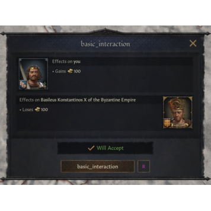

# Interactions modding

Character interactions are set up in common/character_interactions.

See _character_interactions.info file in that folder for more details.


- [Example](#example)


## Example

The simplest interaction looks like this:
```coffee
basic_interaction = {
  on_accept = {
    scope:actor = {
      add_gold = 100
    }
    scope:recipient = {
      remove_short_term_gold = 100
    }
  }
  auto_accept = {
    always = yes
  }
}
```



Interactions expect the recipient to accept it and then an effect happens. auto_accept makes it instant, which is nice for testing.

We can also use on_send instead, but that won't create a preview of the effects.

On_accept and other effect blocks don't have a root scope, so we need to tell the interaction who the effects should apply to.

There are scopes provided by game code for us:

- **scope:actor** - the character who initiated the interaction
- **scope:recipient** - the recipient of the interaction

Always remember to scope to a character first and then apply the effects.

Note that the interaction above will appear in "Uncategorized" category in the interactions menu.

A properly formatted interaction should have a category and an icon. And potentially a description.
Category:Modding

---

*Source: https://ck3.paradoxwikis.com/Interactions_modding*
