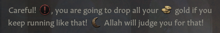
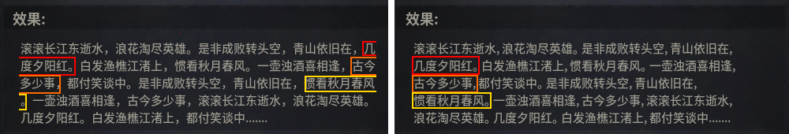

# Localization

> **Note:** Last verified for version 1.4


Localization is the text presented to the player in the game in their selected language. It's used everywhere: events, UI, tooltips, etc.

Script uses localization keys, like text_example, which is then turned to real text in a localization file like this:

``text_example: "Example text"``

Localization files:

- use .yml format
- must use UTF-8 BOM encoding. It is often displayed at the bottom right in text editors. Look also for Select Encoding or Save With Encoding options.
- are saved to ``localization/`` folder, and the right language subfolder. E.g ``localization/english``
- must  include ``l_&lt;language&gt;`` in their name. E.g. ``my_locs_l_english.yml`` or ``my_locs_l_french.yml``


```c
l_english:
 text_example: "Example text"
```

- must start with the same ``l_&lt;language&gt;:`` on the first line. E.g.

Note ``l_`` is a small L, not 1 or capital i. ``localization`` is also spelled with a z, not s.

Localized text must be surrounded by quotation marks: "". Dialog inside it may also use quotation marks, it won't end the string early.

A line break is done with ``\n``, and using two of them will yield you an empty line for paragraph separation. For example, ``"Hello\n\nWorld"`` would be displayed as:

```c
Hello

World
```

``\n`` only works in localization files, not when put directly in UI.

If a mod doesn't include localization for other languages, the game will display unlocalized keys for those playing in another language. To prevent this, copy all locs to other language folders, replacing l_english in both file names and on the first line. Modding discord has a script to do it quickly.

A space before a new loc line is optional and speeds up loading of big files, as discovered by modders through testing.

Most localization keys can be overwritten individually without replacing the whole file, if your file is placed in a folder called "replace".

Both ``localization/replace/english`` and ``localization/english/replace`` work, but the first path takes precedence over the other (which may matter if multiple mods  try to overwrite the same files).

Localization entries may also look like this:


```
murder_successful_roll_tt:0 "[target.GetShortUINameNoTooltip] is killed!"
 murder_become_discovered_roll_tt:0 "#N My involvement is discovered#!"
```


The number after the: is optional and it does nothing for modders. Paradox used to use those numbers for their translation teams to indicate new versions of localization. This is now completely deprecated, you do not need to add any numbers.

The part between [ ] is code that looks up something in the game (in this case a character's name) and puts it in the text. The ``#N`` and ``#!`` control how the text is displayed; in this case as something "negative" (bad for the player). See the sections below for more details on those.

Most of the formatting styles can be found in ``gui/preload/textformatting.gui``. That's also where you can add your own styles for your mod.

A few more are defined in ``Crusader Kings III/jomini/gui/jomini/basetextformatting.gui``.


- [Formatting](#formatting)
- [Re-use other entries](#re-use-other-entries)
- [Data Types](#data-types)
  - [Gender](#gender)
  - [Character names](#character-names)
  - [Arguments](#arguments)
- [Special Characters](#special-characters)
- [Linking](#linking)
  - [Game Concepts](#game-concepts)
  - [Example Custom Game Concept](#example-custom-game-concept)
  - [common\game_concepts\MY_game_concepts.txt](#commongame_conceptsmy_game_conceptstxt)
  - [localization\english\MY_l_english.yml](#localizationenglishmy_l_englishyml)
  - [Traits](#traits)
  - [Titles](#titles)
- [Rounding numbers](#rounding-numbers)
- [Icons](#icons)
- [Usage of special characters & Line breaks](#usage-of-special-characters-line-breaks)
- [Chinese punctuation](#chinese-punctuation)
- [References](#references)


## Formatting

<figure>


<figcaption>Example of all formatting styles in the game</figcaption>
</figure>
Localization strings can contain formatting directives. Text formatting should begin with a ``#`` character and end with ``#!``.

Make sure to add a space before the text!


```
1. <formatting code> <text>#!

Example:
1. P Green#!
```


See [Special Characters]() below for more details.


## Re-use other entries

Insert other localization keys: $&lt;other key&gt;$

Example:

```
special_contract_march_short:0 "March"
 unlock_march_contract:0 "Unlocks the #high $special_contract_march_short$#! [feudal_contract|E]"
```


This is useful both to avoid duplication, and to make sure that entries stay in sync with each other; for example if you ever change the description of ``special_contract_march_short``, the ``unlock_march_contract`` message will automatically change with it.

The same $ notation is used to refer to special values supplied by the game engine. For example:


```
tooltip_feudal_elector_anti_vote_ruler_lunatic:1 "I do not trust the judgment of a [GetTrait('lunatic_1').GetName( candidate.Self )] ruler: $VALUE|=+0$"
```


Here ``$VALUE$`` is a number supplied by the game, and the &lt;code>|=+0`` part controls how that number is shown (see "Rounding numbers" below for details). Special values like this can only be used in localization entries that are shown in specific contexts; in this case, on the elective title voting screen.


## Data Types

Data types are used to make localization dynamic and change based on certain conditions. Invoking a type will print out a specific string of text.  

Data types need to be scoped, usually to a character. Example:


```
[ROOT.Char.GetLadyLord] [ROOT.Char.GetNamePossessiveRegnal] [ROOT.Char.GetFirstNameNicknamed]
```

Use console command ``dump_data_types`` to print out all data types to your logs folder: Documents\Paradox Interactive\Crusader Kings III\logs\data_types.

The logs will show where certain types can be used and what they return: another type, a string, an integer, etc.

The logs will be split into different files. To make it easier to search through them, you can merge them by creating a .bat file with the following code:

``type *.txt > ALL_DATA_TYPES.txt``

Then run the .bat inside the data_types folder.

Data types can also be looked up in the game with ``data_types_explorer`` console command. Note that it makes the distinction between promotes and functions, but it's not important when using them. The main difference seems to be that promotes return a scope, like Character or Title (similar to event targets in script) and functions return a value or perform an action (like effects and triggers).


### Gender

These functions will show text that vary based on the gender of the character in scope.


| **Function** |
| --- |
| GetHerHim |
| GetHerHis |
| GetHerHisMy |
| GetHersHis |
| GetHerselfHimself |
| GetLadyLord |
| GetSheHe |
| GetDaughterSon |
| GetDaughterSonPossessive |


### Character names

These functions will show some variation of the name of the character. This is not a complete list.


<details>
<summary>Show/Hide</summary>


| **Function** |
| --- |
| GetFirstName |
| GetFirstNameBase |
| GetFirstNameNicknamed |
| GetFirstNameNicknamedNoTooltip |
| GetFirstNameNicknamedNoTooltipRegnal |
| GetFirstNameNicknamedOrMe |
| GetFirstNameNicknamedOrMeNoTooltip |
| GetFirstNameNicknamedOrMeNoTooltipRegnal |
| GetFirstNameNicknamedOrMeRegnal |
| GetFirstNameNicknamedPossessive |
| GetFirstNameNicknamedPossessiveNoTooltip |
| GetFirstNameNicknamedPossessiveNoTooltipRegnal |
| GetFirstNameNicknamedPossessiveOrMy |
| GetFirstNameNicknamedPossessiveOrMyNoTooltip |
| GetFirstNameNicknamedPossessiveOrMyNoTooltipRegnal |
| GetFirstNameNicknamedPossessiveOrMyRegnal |
| GetFirstNameNicknamedPossessiveRegnal |
| GetFirstNameNicknamedRegnal |
| GetFirstNameNoTooltip |
| GetFirstNameNoTooltipRegnal |
| GetFirstNameOrMe |
| GetFirstNameOrMeNoTooltip |
| GetFirstNameOrMeNoTooltipRegnal |
| GetFirstNameOrMeRegnal |
| GetFirstNamePossessive |
| GetFirstNamePossessiveNoTooltip |
| GetFirstNamePossessiveNoTooltipRegnal |
| GetFirstNamePossessiveOrMy |
| GetFirstNamePossessiveOrMyNoTooltip |
| GetFirstNamePossessiveOrMyNoTooltipRegnal |
| GetFirstNamePossessiveOrMyRegnal |
| GetFirstNamePossessiveRegnal |
| GetFirstNameRegnal |
| GetTitledFirstName |
| GetFullName |
| GetFullNameNicknamed |
| GetFullNameNicknamedNoTooltip |
| GetFullNameNicknamedNoTooltipRegnal |
| GetFullNameNicknamedOrMe |
| GetFullNameNicknamedOrMeNoTooltip |
| GetFullNameNicknamedOrMeNoTooltipRegnal |
| GetFullNameNicknamedOrMeRegnal |
| GetFullNameNicknamedPossessive |
| GetFullNameNicknamedPossessiveNoTooltip |
| GetFullNameNicknamedPossessiveNoTooltipRegnal |
| GetFullNameNicknamedPossessiveOrMy |
| GetFullNameNicknamedPossessiveOrMyNoTooltip |
| GetFullNameNicknamedPossessiveOrMyNoTooltipRegnal |
| GetFullNameNicknamedPossessiveOrMyRegnal |
| GetFullNameNicknamedPossessiveRegnal |
| GetFullNameNicknamedRegnal |
| GetFullNameNoTooltip |
| GetFullNameNoTooltipRegnal |
| GetFullNameOrMe |
| GetFullNameOrMeNoTooltip |
| GetFullNameOrMeNoTooltipRegnal |
| GetFullNameOrMeRegnal |
| GetFullNamePossessive |
| GetFullNamePossessiveNoTooltip |
| GetFullNamePossessiveNoTooltipRegnal |
| GetFullNamePossessiveOrMy |
| GetFullNamePossessiveOrMyNoTooltip |
| GetFullNamePossessiveOrMyNoTooltipRegnal |
| GetFullNamePossessiveOrMyRegnal |
| GetFullNamePossessiveRegnal |
| GetFullNameRegnal |
| GetName |
| GetNameNicknamed |
| GetNameNicknamedNoTooltip |
| GetNameNicknamedNoTooltipRegnal |
| GetNameNicknamedOrMe |
| GetNameNicknamedOrMeNoTooltip |
| GetNameNicknamedOrMeNoTooltipRegnal |
| GetNameNicknamedOrMeRegnal |
| GetNameNicknamedPossessive |
| GetNameNicknamedPossessiveNoTooltip |
| GetNameNicknamedPossessiveNoTooltipRegnal |
| GetNameNicknamedPossessiveOrMy |
| GetNameNicknamedPossessiveOrMyNoTooltip |
| GetNameNicknamedPossessiveOrMyNoTooltipRegnal |
| GetNameNicknamedPossessiveOrMyRegnal |
| GetNameNicknamedPossessiveRegnal |
| GetNameNicknamedRegnal |
| GetNameNoTooltip |
| GetNameNoTooltipRegnal |
| GetNameOrMe |
| GetNameOrMeNoTooltip |
| GetNameOrMeNoTooltipRegnal |
| GetNameOrMeRegnal |
| GetNamePossessive |
| GetNamePossessiveNoTooltip |
| GetNamePossessiveNoTooltipRegnal |
| GetNamePossessiveOrMy |
| GetNamePossessiveOrMyNoTooltip |
| GetNamePossessiveOrMyNoTooltipRegnal |
| GetNamePossessiveOrMyRegnal |
| GetNamePossessiveRegnal |
| GetNameRegnal |


</details>


### Arguments

Arguments are used to modify the output of a function. They always go at the end of a function.


| **Argument** | **Description** | **Example** | **Without Argument** | **With Argument** |
| --- | --- | --- | --- | --- |
| &lt;pre>|U</pre> | Sets first letter to uppercase | `Tea is ready, my [ROOT.Char.GetLadyLord|U].` | Tea is ready, my lady. | Tea is ready, my Lady. |
| &lt;pre>|L</pre> | Sets first letter to lowecase | `Tea is ready. [ROOT.Char.GetSheHe|L] said.` | Tea is ready. He said. | Tea is ready. he said. |


## Special Characters

Some sets of characters perform special functions.

The full list of available formatting styles can be found in ``gui/preload/textformatting.gui``. That's also where you can add your own styles for your mod.

You can also combine formatting codes with a ``;`` (semicolon), like ``#high;bold`` to get both. However, if you find yourself doing that it may be better to define a new style.

| **Characters** | **Description** | **Example** |
| --- | --- | --- |
| \n | Line break. Works only in certain cases. |  |
| #P | Formats text green, as "positive" | `#P A very good thing has happened#!` OR `[GetFullName|P]` |
| #N | Formats text red, as "negative" | `#N A rather bad thing has happened#!` OR `[GetFullName|N]` |
| #help | Text is shown using a help style, with blue gray and italic | `#help If you do not give either Gold or Soldiers to the war effort, your [head_of_faith|E] will condemn you and you will lose [piety|E].#!` |
| #I | Text is displayed in an informational style, green and italic | `#I Click to view your [GetPlayer.GetCouncillorPosition( 'councillor_court_chaplain' ).GetPositionName]#!` |
| #warning | Text is displayed as a warning, red and italic | `#warning Only your younger children lacks [guardians|E]#!` |
| #X | Text is displayed as a warning,same as above | `#X Choosing a New Appearance will discard ALL previous changes!#!` |
| #T | Text is displayed as a title, bold and large | `#T Randomize Dynasty Name#!` |
| #E | Text is displayed as a game concept, light blue | `#E Randomize#!` |
| #S | Formats text bold and italic | `#S Occupying Counties:#!` |
| #V | Formats text white | `#V This text is white #!` OR `[GetFullName|V]` |
| #EMP | Text is emphasized, italic | `#EMP Emphasis here #!` |
| #weak | Text is darker and italic | `#weak footnote or aside #!` |
| #bold | Text is displayed in bold | `You have #bold NOT #! done this` |
| #italic | Text is displayed in italics | `You #italic will #! do this` |
| #indent_newline:N | (N being a number)<br>How many spaces to put after line breaks | `#indent_newline:2` |


## Linking


### Game Concepts

Localization strings can link to game concepts as follows:


```
[concept_key|E]

1. So for example
[faith|E]
```


By default the concept starts with first letter in upper case, you can set the first letter in lower case as follows:


```
[concept_key|El]

1. So for example
"The word [faith|El] is now starting by a lower case letter"
```


The expression linking to the game concept can be customized as follows:


```
[Concept('concept_key','Customized expression')|E]

1. So for example
"The game concept link [Concept('faith','religion')|E] is now written as religion."
```


### Example Custom Game Concept

If you want to add custom game concept and show it's description:

```
        1. 
### common\game_concepts\MY_game_concepts.txt
        1. 
my_custom_concept = {
}
```


```
        1. 
### localization\english\MY_l_english.yml
        1. 
l_english: 
  game_concept_my_custom_concept:0 "My Name"
  game_concept_my_custom_concept_desc:0 "My Description"
  # example override description for government
  game_concept_government_desc:2 "[my_custom_concept|E]"
```


### Traits

Similarly, you can link to a trait with:


```
[GetTrait('trait_name').GetName(GetNullCharacter)]
```


This will cause the trait to have a tooltip which shows the trait information. You can also pass an actual character into the ``GetName`` function, so that any conditional descriptions display properly. For example, the localization text for adding a trait passes in the character who will receive the trait:


```
1. note that the [trait|E] links to the game concept of a trait, as described above, while the [TRAIT.GetName( Character.Self )|LV] links to the actual trait which will be gained
1. from localization/english/effects_l_english.yml
ADD_MY_TRAIT:2 "You gain the [trait|E] [TRAIT.GetName( CHARACTER.Self )|LV]"
```


Note that the &lt;code>|LV``, which will cause the trait to be written as lowercase and in a white font (see the above sections on [Command Arguments](#command_arguments) and [Special Characters](#special_characters), respectively), appears to be idiomatic in the vanilla game files.


### Titles

You can also link to a specific title with:


```
[GetTitleByKey('title_name').GetName]
```


This will cause the title to have a tooltip which shows the title information. You can also use ``GetNameNoTier`` so that only the title's name will appear.


## Rounding numbers

If a numeric value has a decimal portion, it can be rounded by using the desired number of decimal places, such as:


```
1. Round to 2 decimals
[some_value|2]

1. Remove all decimals:
[some_value|0]
```


Note that the value is **always** rounded down.


## Icons

Icons can be displayed in loc keys by using `@icon_name!` to render them.


```
Careful! @warning_icon!, you are going to drop all your @gold_icon! gold if you keep running like that! @piety_icon_islam! Allah will judge you for that!
```


<details>
<summary>Show/Hide</summary>


<table>
<tr><th colspan="9">Icon Addresses</th></tr>
<tr><th colspan="4">Generic Icons</th><th colspan="3">Military Icons</th><th>Faith Icons</th><th>Terrain Icons</th></tr>
<tr><td>warning_icon</td><td>skill_martial_icon</td><td>unspent_strong_hook_icon</td><td>friend_icon</td><td>soldier_icon</td><td>heavy_cavalry_icon</td><td>pikemen_icon</td><td>catholic_icon</td><td>plains</td></tr>
<tr><td>gold_icon</td><td>skill_stewardship_icon</td><td>crime_icon</td><td>best_friend_icon</td><td>bombard_icon</td><td>heavy_infantry_icon</td><td>skirmishers_icon</td><td>orthodox_icon</td><td>forest</td></tr>
<tr><td>prestige_icon</td><td>skill_intrigue_icon</td><td>intimidated_icon</td><td>rival_icon</td><td>bondi_icon</td><td>horse_archers_icon</td><td>trebuchet_icon</td><td>custom_faith_1_icon (10)</td><td>mountains</td></tr>
<tr><td>time_icon</td><td>skill_learning_icon</td><td>terrified_icon</td><td>nemesis_icon</td><td>bowmen_icon</td><td>jomsviking_pirates_icon</td><td>varangian_veterans_icon</td><td>virtue_icon</td><td></td></tr>
<tr><td>cross_icon</td><td>skill_prowess_icon</td><td>weak_hook_icon</td><td>lover_icon</td><td>camel_riders_icon</td><td>light_cavalry_icon</td><td>vigmen_icon</td><td>sin_icon</td><td></td></tr>
<tr><td>stress_icon</td><td>stress_gain_icon</td><td>pending_court_events</td><td>soulmate_icon</td><td>crossbowmen_icon</td><td>mangonel_icon</td><td>war_elephants_icon</td><td>fervor_icon</td><td></td></tr>
<tr><td>dread_icon</td><td>stress_critical_icon</td><td>realm_capital_icon</td><td></td><td>danish_huskarls_icon</td><td>onager_icon</td><td>advantage_icon</td><td></td><td></td></tr>
<tr><td>exposed_icon</td><td>stress_loss_icon</td><td>alliance_icon</td><td></td><td>countered_icon</td><td>supply_icon</td><td>gathering_icon</td><td></td><td></td></tr>
<tr><td>portrait_punishment_icon</td><td>death_icon</td><td>prestige_level_0_icon (5)</td><td></td><td>fort_icon</td><td>garrison_icon</td><td>army_quality_icon_1 (5)</td><td></td><td></td></tr>
<tr><td>skill_diplomacy_icon</td><td>scheme_icon</td><td>dynasty_prestige_icon (5)</td><td></td><td>knight_icon</td><td>embarked_icon</td><td>no_siege_weapon_icon</td><td></td><td></td></tr>
</table>

</details>


## Usage of special characters & Line breaks

If you wish to input characters such as **"** in a string, utilize **\** before every usage:

```
Hello, I am \"totally\" not going to stab you!
Hello, I am #weak\"totally\" not# going to stab you!
```


If you want to break line, you can use **\n**:

```
This is line one, which will show up above,\nWhile this is line two, coming right at you from below.
```


Avoid adding spaces before or after the line break to preserve the text's alignment.

When adding multiple paragraphs, keep in mind that you can assign multiple keys to the same desc, which is particularly useful if you want to customize just one paragraph. For example, you can have a localization file with:


```
paragraph_separator:0 "\n\n"

first_paragraph:0 "Generic intro text"

maybe_second_paragraph:0 "Conditional text"
alternative_second_paragraph:0 "Alternative text"

final_paragraph:0 "Generic outro text"
```


Then, you can define an event like this:


```
event_name.100 = {
  desc = {
    desc = first_paragraph
    desc = paragraph_separator
    first_valid = {
      triggered_desc = {
        limit = { some_trigger = yes }
        desc = maybe_second_paragraph
      }
      triggered_desc = {
        limit = { some_trigger = no }
        desc = alternative_second_paragraph
      }
    }
    desc = paragraph_separator
    desc = final_paragraph
  }
}
```


This will be much easier to maintain than keeping 2 different entries in sync, and will be easier to read in the localization file.


## Chinese punctuation

A common issue with Chinese text in earlier versions of the game is that lines were broken apart in the the wrong places, such as in the middle of words. This is caused by the game engine not recognising the Chinese ideographic punctuation marks as punctuation, so it treated lines of Chinese text as single words and inserted breaks wherever it wanted.

Sadly an engine fix was impossible, so to ensure proper line breaking in Chinese text, you need to use a half-width versions of the punctiation, followed by a space. Using the right character substitutions, the visual change should be minimal and the line breaks do end up in the proper places.




| **Original** | **Codepoint** | **Substitution** | **Codepoint** | **Note** |
| --- | --- | --- | --- | --- |
| `。` | U+3002 Ideographic Full Stop | `｡` | U+FF61 Halfwidth Ideographic Full Stop (and space) |  |
| `，` | U+FF0C Fullwidth Comma | `,` | U+002C Comma (and space) | Since there is no Chinese-style halfwidth comma, a Latin one may be an acceptable substitute. |
| `，` | U+FF0C Fullwidth Comma | `､` | U+FF64 Halfwidth Ideographic Comma (and space) | This can also be used for the comma, but note the visual difference. |
| `-` | U+002D Hyphen-Minus | `‑` | U+2011 Non-Breaking Hyphen | This is a wholly optional substitution to prevent a hyphen from being detected as a word boundary; use this to lessen the chance of line breaks there. |


## References


Category:Modding

---

*Source: https://ck3.paradoxwikis.com/Localization*
